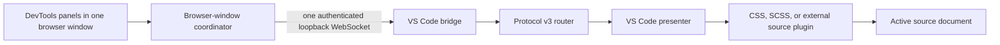

# Browser2IDE

[](https://github.com/conus-vision/Browser2IDE/actions/workflows/ci.yml)

Connect browser DevTools to your IDE and highlight the source code related to a selected DOM element.

> Alpha: the protocol and installation formats may change before 1.0.

## What It Does

Browser2IDE connects a DevTools panel to a local VS Code window. When Inspect is
enabled and an element is selected, bounded DOM and CSS facts travel over a
loopback WebSocket. VS Code resolves those facts against the active document
and highlights applicable source blocks without editing files or switching
editors.

## Current Support

| Capability | Status | Notes |
| --- | --- | --- |
| Firefox Stable 142+ | Supported | Uses the Browser2IDE DevTools extension. |
| Chrome/Chromium 116+ | Supported | Uses the shared Manifest V3 browser runtime. |
| Local VS Code | Supported | Browser2IDE starts automatically in each local VS Code window. |
| CSS | Supported | Matches applicable rules in the active CSS document. |
| Source-mapped SCSS | Supported | Requires an inline or external source map. |
| Remote SSH and WSL | Unsupported | Remote VS Code extension hosts are outside the alpha scope. |
| Browser extension stores | Unsupported | Public store installation is not available yet. |
| Editing and reverse sync | Unsupported | Protocol v3 is read-only. |

## Install

The installable `0.2.0` files are release candidates and are not published yet.
When the signed release is available, its GitHub Release will provide:

- `browser2ide-vscode-0.2.0.vsix`;
- `browser2ide-chrome-0.2.0.zip`;
- `browser2ide-firefox-0.2.0.xpi`, signed by Mozilla.

There is currently no signed Firefox XPI or published `0.2.0` release. The
unsigned Firefox ZIP produced by the build is source-submission input and is not
a persistently installable Firefox Stable add-on.

Use the [installed artifact guide](docs/installed-verification.md) for UI
installation, linking, and candidate acceptance. It also records which `0.2.0`
checks are complete and which still require signed-release evidence. Contributors
testing a source checkout should use the separate
[Development Host verification guide](docs/mvp-verification.md).

## Link A Browser Window

1. Open the project in the local VS Code window that should receive selections.
2. Click the Browser2IDE status item to copy its seven-digit link code.
3. Open DevTools in Firefox 142+ or Chrome/Chromium 116+ and select the
   Browser2IDE panel.
4. Click Paste, or enter the code manually, and select Link.
5. After the panel connects, explicitly enable Inspect and select an element.

The link applies to the browser window, not just one tab. Browser2IDE never
auto-discovers VS Code instances or probes for them. DevTools panels in the
same linked window reuse its session mapping and share at most one active
WebSocket while panels are active. A different browser window must be linked
separately. Use Change IDE to link the current browser window elsewhere, or
Unlink to revoke its mapping and disconnect it. Inspect is always an explicit
toggle and does not resume automatically.

## Verify CSS And SCSS

Open a CSS document in VS Code, enable Inspect in the linked panel, and select
an element whose matched rules are in that document. Browser2IDE highlights
the applicable complete blocks for the selected element and its immediate DOM
parent. For SCSS, open the original SCSS document and ensure the inspected CSS
has an inline or external source map. Browser2IDE does not guess SCSS mappings
when a source map is unavailable.

## Architecture



The browser collects bounded inspection facts; the local bridge authenticates
and routes them; the presenter asks a compatible source plugin to resolve the
active document. See the [architecture overview](docs/architecture.md) and the
[protocol contract](docs/protocol.md).

## Source Plugins

Source plugins are separately installed VS Code extensions that register a
versioned resolver for compatible active documents. Built-in CSS and SCSS
plugins use the same API. See the [source plugin authoring guide](docs/source-plugin-authoring.md).

## Security And Privacy

Browser2IDE has no analytics or remote service. Product traffic is limited to
an explicitly linked browser window and a VS Code bridge bound to `127.0.0.1`.
The browser extensions require `<all_urls>` so inspection can work on the page
the user is debugging, but injection occurs only when the DevTools panel is
open, the window is linked, and Inspect is enabled.

Full page URLs/routes and permitted DOM attribute values are bounded but are
not content-redacted; they can contain sensitive application data. Review the
[security model](docs/security.md), [security policy](SECURITY.md), and
[privacy details](PRIVACY.md) before inspecting sensitive pages.

## Development

Use Node.js 22 and Corepack, then install and run the repository gates:

```powershell
corepack enable
corepack pnpm install --frozen-lockfile
corepack pnpm build
corepack pnpm test
corepack pnpm test:integration
corepack pnpm typecheck
corepack pnpm lint
```

The [contributor guide](CONTRIBUTING.md) includes the separate Firefox
`web-ext` validation command and contribution requirements.

## Roadmap

The alpha focuses on a reliable read-only protocol, installed-package release
artifacts, and source-plugin extensibility. Public browser stores, Remote
SSH/WSL extension hosts, source editing, and reverse synchronization are not
currently supported.

## Contributing

Issues and pull requests are welcome. Read [CONTRIBUTING.md](CONTRIBUTING.md)
before starting, and report vulnerabilities through the private process in
[SECURITY.md](SECURITY.md).

## License

Browser2IDE is available under the [MIT License](LICENSE). Copyright (c) 2026
conus-vision.
